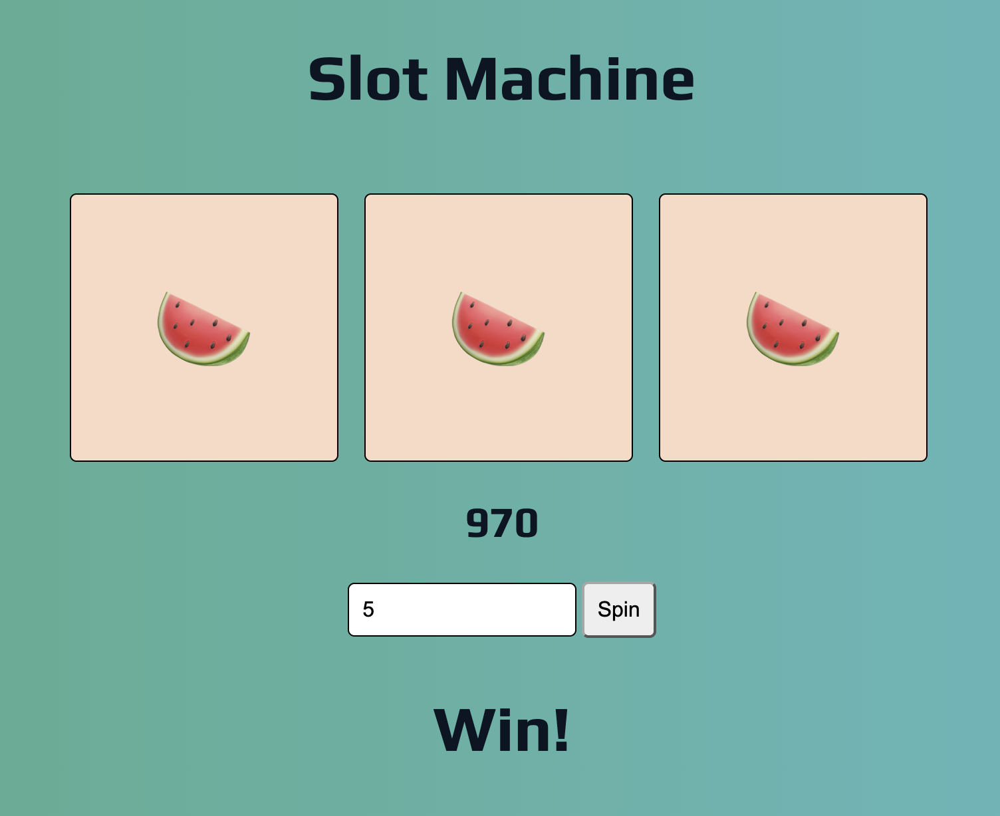

# 🎰 Slot Machine

A fun and interactive slot machine built



This project was created using **HTML, CSS, and JavaScript** and is designed to be responsive across different screen sizes. Players can place a minimum or maximum bet, spin three reels, and watch their total update based on the game results.

## ✨ Features

- 🎰 Three interactive slot machine reels
- 🎲 At least 5 possible items on each reel
- 💰 Minimum and maximum betting options
- 📊 Player total updates as they play
- 📱 Responsive design for different screen sizes
- 🎨 Cute and simple interface
- ⚡ Interactive gameplay using JavaScript

## 🛠️ Built With

- HTML
- CSS
- JavaScript

## 🎯 Project Goal

The goal of this challenge was to build a functional slot machine with **three reels** and a minimum of **five items per reel**.

The player should be able to choose between minimum and maximum bets, spin the reels, and have their total update throughout the game.

This project helped me practice working with:

- JavaScript logic and conditionals
- Functions
- Variables and scope
- DOM manipulation
- Event listeners
- Updating information on the page dynamically
- Responsive CSS

## 💡 What I Learned

This project gave me more practice turning JavaScript logic into an interactive experience.

One of my biggest challenges was understanding **scope** and keeping track of where variables and functions could be accessed, especially as the project grew and more conditional logic was added.

It also helped me see where I could simplify my code instead of using longer conditional statements.

## 🚀 Running the Project

1. Clone the repository:

```bash
git clone https://github.com/smayanja3/slot-machine-2019-week05.git
```

2. Open the project folder.

3. Open `index.html` in your browser.

4. Place your bet and spin the reels! 🎰

Thanks for checking out my project! 🎰✨
